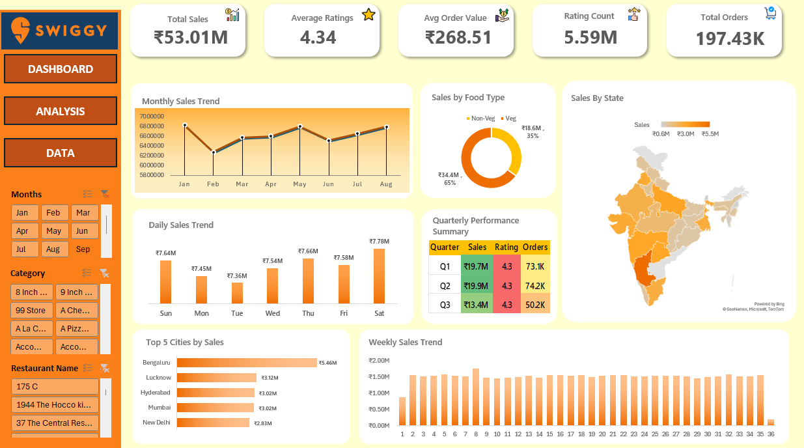

# Swiggi_Sales_Analysis
Swiggy Sales Analysis Dashboard built using Microsoft Excel to analyze sales, orders, ratings, food types, states, cities, and time-based trends.

## Project Overview

This project analyzes Swiggy food delivery sales data using Microsoft Excel.

The objective of the project is to understand sales performance, order trends, customer ratings, food-type contribution, and geographical sales distribution through an interactive dashboard.

## Tools Used

- Microsoft Excel
- Excel Pivot Tables
- Pivot Charts
- Slicers
- Data Cleaning
- Data Analysis
- Dashboard Design

## Key Performance Indicators

The dashboard includes the following KPIs:

- Total Sales
- Average Rating
- Average Order Value
- Ratings Count
- Total Orders

## Analysis Performed

The dashboard analyzes:

- Monthly Sales Trend
- Daily Sales Trend
- Total Sales by Food Type
- Total Sales by State
- Quarterly Performance
- Top 5 Cities by Sales
- Weekly Sales Trend

 ## Dashboard
 
 
## Problem Statement

The project focuses on analyzing Swiggy sales data to understand:

- How sales change over time
- Which food types contribute more to revenue
- Which states generate higher sales
- Which cities contribute the most revenue
- How orders and ratings vary over time
- Quarterly and weekly sales performance

## Business Insights

- **Overall Performance:** The business generated **₹53.01M in total sales** from approximately **197.43K orders**, with an **Average Order Value of ₹268.51**.

- **Food Type Contribution:** **Non-Veg orders contributed approximately ₹34.4M (65%)** of total sales, while **Veg orders contributed approximately ₹18.5M (35%)**, showing a higher revenue contribution from Non-Veg orders.

- **Monthly Sales Trend:** Sales fluctuated across the months from **January to August**, with January showing one of the highest monthly sales levels, followed by a decline in February and fluctuations throughout the remaining months.

- **Daily Sales Performance:** **Saturday recorded the highest daily sales at approximately ₹7.78M**, while **Tuesday recorded the lowest at approximately ₹7.36M** among the days displayed.

- **Quarterly Performance:** **Q2 recorded the highest sales at approximately ₹19.9M and 74.2K orders**, followed by Q1 with approximately **₹19.7M and 73.1K orders**. Q3 recorded approximately **₹13.4M and 50.2K orders**.

- **Customer Ratings:** The dashboard shows an **Average Rating of 4.34** with approximately **5.59M ratings**, providing a view of customer feedback across the analyzed orders.

- **Top Cities by Sales:** **Bengaluru, Lucknow, Hyderabad, Pune, and New Delhi** were identified as the top 5 cities by sales in the dashboard, highlighting major urban markets contributing to overall revenue.

- **Weekly Sales Trend:** Weekly sales remained relatively stable across the analyzed period, with fluctuations in sales levels across individual weeks.

- **Geographical Sales Distribution:** The state-wise map visualization shows that sales are distributed across multiple regions, allowing geographical differences in revenue contribution to be identified.

- **Order Value:** The **Average Order Value of ₹268.51** provides an estimate of the average revenue generated from each order and can be used as a key metric for monitoring order-level performance.

## Key Skills Demonstrated

- Data Cleaning
- Data Transformation
- Pivot Tables
- Data Visualization
- KPI Analysis
- Trend Analysis
- Dashboard Development
- Business-oriented Data Analysis

## Project Files

- `Swiggy Sales Analysis.xlsb` – Excel analysis and dashboard

## Conclusion

This project demonstrates how Excel can be used to transform sales data into an interactive dashboard and generate meaningful business insights through KPIs, charts, and trend analysis.
